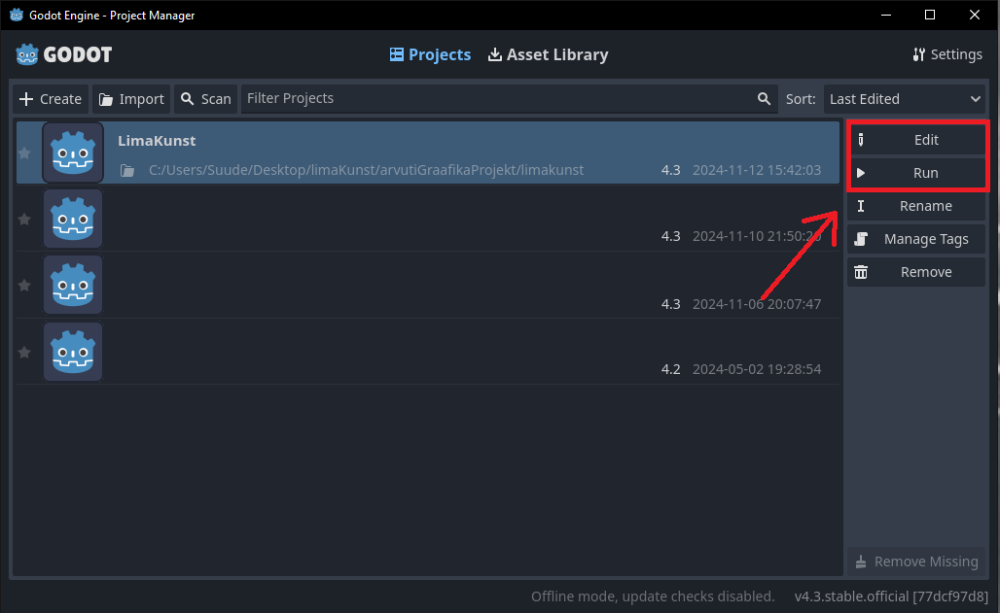

# Welcome!

This repository contains a group project made by Joosep Suuder, Henri Maandi, Kerli Tasso.
The aim of this project is to simulate Physarum polycephalum, using compute shaders in the Godot game engine.

### How to run

1. Download the latest version of Godot [here](https://godotengine.org/).
2. Extract the contents to your directory of choosing
3. Pull the repository
4. Open the project in Godot, either run to use the program or edit to view the source.

Alternatively:

5. Download the exe from [here](https://owncloud.ut.ee/owncloud/s/Kp2AFTtLHjfRNrH).

---
### Some examples of simulation outputs

